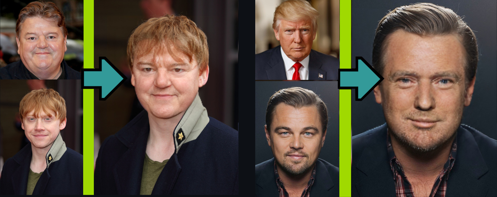
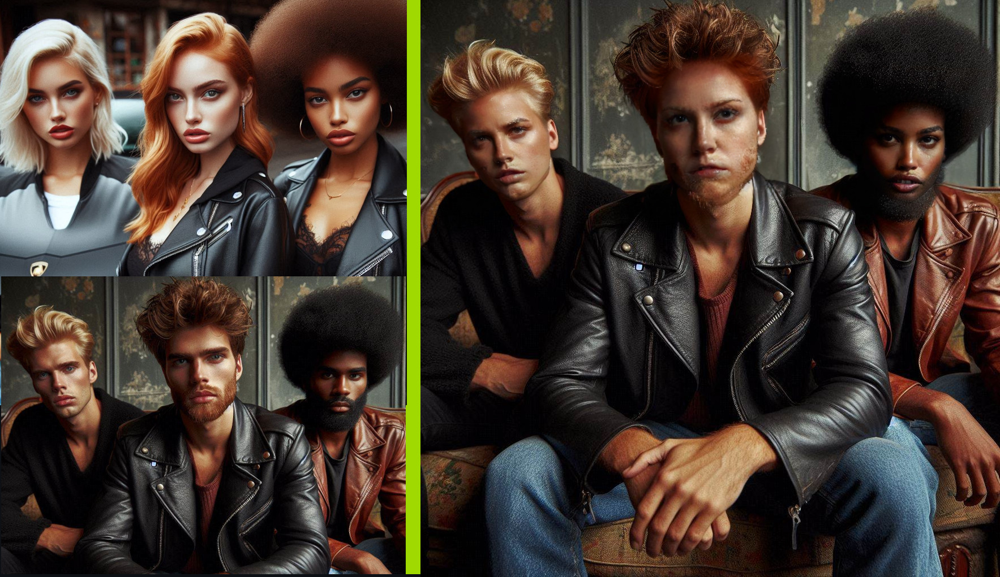
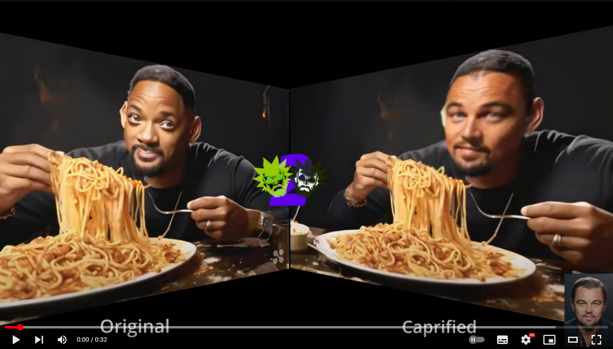
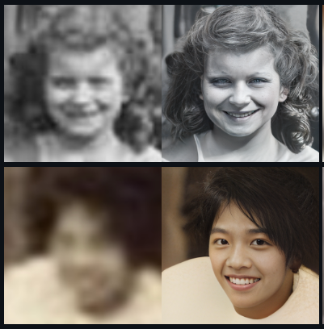

  <h1 align="center" style="margin-top:-25px">Face2Face</h1>

<p align="center">
  
</p>
  <h3 align="center" style="margin-top:-10px">Instantly swap faces in images and videos</h3>
<br/>
Face2Face is a generative AI technology to swap faces (aka Deep Fake) in images from one to another. 
For example, you can swap your face with Mona Lisa or your favorite celebrity.

With this repository you can:

- [Swap faces from one image to another](#swap-faces-from-one-image-to-another). 
- [Swap faces in videos](#swap-faces-in-videos).
- [Face embeddings](#face-swapping-with-saved-reference-faces). Create face embeddings. With these embeddings you can later swap faces just by using the name.
- [Face restoration](#face-enhancing): Enhance image quality of a portrait with a face enhancer model.
- Identify faces with face-recognition
- [Run face swapping as a service](docs/WebService.md).


This is a one shot model; for this reason only one face is needed to swap. It should work for all kinds of content, also for anime.
The face swapping model itself was created by [Insightface](https://github.com/deepinsight/insightface)

We provide the face swapping functionality as SDK and as a convenient web (openAPI) API with [FastTaskAPI](https://github.com/SocAIty/FastTaskAPI).
The endpoint allows you to easily deploy face swapping, recognition and restoration as a service.

## Example swaps
| [Face-swap](#swap-faces-from-one-image-to-another)    | [Multi-face Swap](#swap-faces-from-one-image-to-another ) | 
|-------------------------------------------------------|-----------------------------------------------------------|
|  |   |


| [Video-swapping](#swap-faces-in-videos)                                                                 | [Video-Swapping with face-recognition](#swap-faces-in-videos)                                                                              | 
|---------------------------------------------------------------------------------------------------------|------------------------------------------------------------------------------------------------------------------------|
| <a href="https://www.youtube.com/watch?v=dE-d8DIndco"></a> | <a href="https://www.youtube.com/watch?v=7l-3UAWh8Pw"></a> |   


| [Face restoration](#face-enhancing)                        | [Face-Swap with face-recognition](#face-swapping-with-face-recognition-swap-pairs ) |
|------------------------------------------------------------|-------------------------------------------------------------------------------------|
|  |                           |


# Setup

### Install via pip
Depending on your use case you can install the package with or without the service.
```bash
# face2face without service (only for inference from script)
pip install socaity-face2face 
# full package with service
pip install socaity-face2face[full]
```
Additional dependencies:
- For VideoFile support in the webservice you also need to install [ffmpeg](https://ffmpeg.org/download.html) 

Requirements:
- Python 3.7 or higher
- Minimum 5GB of RAM (you'll get a "Killed" message without further information if you run out of memory)
- Recommended: GPU with at least 8GB of VRAM for fast-inference. Runs also on CPU though.

Note: Models are downloaded automatically

# Usage

We provide two ways to use the face swapping functionality.
1. [Direct module import and inference](#Inference-from-script) 
2. [By deploying and calling the web service](#docs/WebService.md)


## Inference from script
Use the Face2Face class to swap faces from one image to another.
First create an instance of the class.

```python
from face2face import Face2Face
f2f = Face2Face(device_id=0) 
```
With the device_id setting you can set the GPU device id. This also allows to run face2face in multiple processes on
different GPUs.

### Swap faces from one image to another
```python
swapped_img = f2f.swap_img_to_img("path/to/src.jpg", "path/to/target.jpg")
```
### Face swapping with saved reference faces

Create a face embedding with the add_reference_face function and later swap faces with the swap_from_reference_face function.
If argument save=true is set, the face embedding is persisted and the f2f.swap_from_reference_face function can be used later with the same face_name, even after restarting the project.

```python
embedding = f2f.add_face("my_new_face", "path/to/my_img_or_video.mp4", save=True)
# Swap all faces in the target image with the face(s) in the face embedding
swapped = f2f.swap(media="path/to/my_img_or_video.jpg", faces="my_new_face")
```

### Face swapping with face recognition (swap pairs)

After an embedding was created, we can recognize / identify those persons.
Then the identified persons can specifically be swapped with defined swap pairs.

```python
# Swap faces with defined swap pairs
# assumption the faces [trump, hagrid, biden, ron] are already added with f2f.add_face
swapped = f2f.swap(
  media="path/to/my_img_or_video.mp4", 
  faces={
      "trump": "hagrid",
      "biden": "ron"
  }
)
```
This function will swap the faces of trump with hagrid and biden with ron.
Therefore it first recognizes the faces in the target image and then swaps them with the defined swap pairs.


### Face swapping with a generator
Iteratively swapping from a list of images

```python
def my_image_generator():
  for i in range(100):
    yield cv2.imread(f"image_{i}.jpg")


# for swapping to always the same face
for swapped_img in f2f.swap_to_face_generator(faces="my_embedding", target_img_generator=my_image_generator()):
  cv2.imshow("swapped", swapped_img)
  cv2.waitKey(1)

# including face recognition
for swapped_img in f2f.swap_pairs_generator(target_img_generator=my_image_generator(), swap_pairs={"trump": "hagrid"}):
  cv2.imshow("swapped", swapped_img)
  cv2.waitKey(1)

```

### Face enhancing

The roop (inswapper) model operates on low resolution - what can harm the result face quality. 
However, there exist AI models, which can enhance the face quality by upscaling the image.
We provide different models for face enhancement: [gfpgan_1.4](https://github.com/TencentARC/GFPGAN), 
and the [gpen](https://github.com/yangxy/GPEN) family.
Check model_definitions.py for the available models.
You can upscale up to 2048 with the GPEN model --> higher quality + higher runtime.
```python
swapped_img = f2f.swap(media="path/to/my_img_or_video.mp4", enhance_face_model='gpen_bfr_512')
```
The corresponding model is automatically downloaded and used when enhance_faces is set to True.

#### Face-enhancing without face-swapping

Alternatively you can enhance faces directly without applying a swap. 
```python
# enhance all faces in the image
enhanced_img = f2f.enhance_faces(image="path/to/my_img.jpg", enhance_face_model='gpen_bfr_512')
# enhance a specific face.
target_img = cv2.imread("path/to/my_img.jpg")
detected_face = f2f.detect_faces(target_img)[0]  # In this case we simply take the first one
enhanced_img = f2f.enhance_single_face(target_img, detected_face, enhance_face_model='gpen_bfr_512')
```

# Disclaimer

The author is not responsible for any misuse of the repository. Face swapping is a powerful technology that can be used for good and bad purposes.
Please use it responsibly and do not harm others. Do not publish any images without the consent of the people in the images.
The credits for face swapping technology go to the great Insightface Team thank you [insightface.ai](https://insightface.ai/). 
This project uses their pretrained models and parts of their code. Special thanks goes to their work around [ROOP](https://github.com/s0md3v/sd-webui-roop).
The author does not claim authorship for this repository. The authors contribution was to provide a convenient API and service around the face swapping.
A big thank you also goes to the authors of [GPEN](https://github.com/yangxy/GPEN) and [GFPGAN](https://github.com/TencentARC/GFPGAN),
who developed the models for face restoration.


# Contribute

Any help with maintaining and extending the package is welcome. Feel free to open an issue or a pull request.

ToDo:
- Improve face swap quality
  - Implement strength factor for applied face
- Improve inference times
  - by implementing batching.
  - by using multi-threading in image_generators
- remove insightface dependency and update onnx version
- streaming for the webserver
