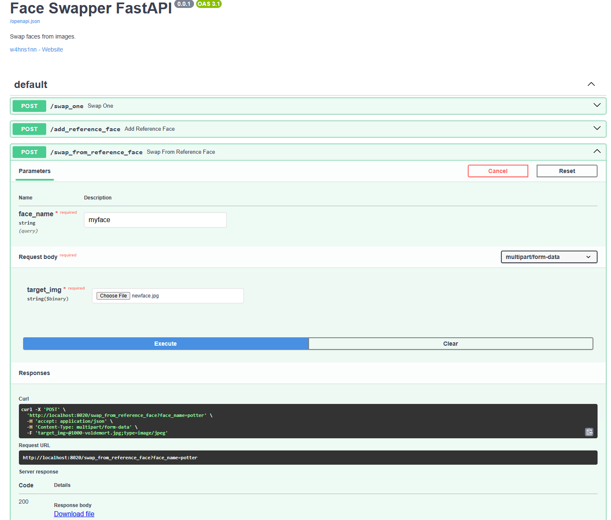

# Face2Face

Face2Face is a generative AI technology to swap faces (aka Deep Fake) in images from one to another. For example you can swap your face with Mona Lisa our your favourite superstar. With this repository you can:

- Swap faces from one image to another. Powered by [Insightface](https://github.com/deepinsight/insightface)
- Create face embeddings. With these embeddings you can later swap faces without running the whole stack again.

All of this is wrapped into a convenient REST API with [FAST_API](https://fastapi.tiangolo.com/)




# Setup

### Install via pip
```python
pip install socaity-face2face 
```
or from GitHub for the newest version.
```python
pip install git+https://github.com/SocAIty/face2face
```

For GPU acceleration also install
pytorch gpu version (with `pip3 install torch torchvision torchaudio --index-url https://download.pytorch.org/whl/cu118`)

### Install and work with the GitHub repository
1. Clone the repository.
2. (Optional) Create a virtual environment. With `python -m venv venv` and activate it with `venv/Scripts/activate`.
3. Install the requirements.
`pip install -r requirements.txt`
4. Don't forget to install pytorch gpu version (with `pip3 install torch torchvision torchaudio --index-url https://download.pytorch.org/whl/cu118`)

# Usage

We provide three ways to use the face swapping functionality.
1. Directly from the script if the package was installed via pip.
2. Via the REST API.
3. As part of the socaity package.


## Inference from script
Use the Face2Face class to swap faces from one image to another.
First create an instance of the class.

```python
from face2face import Face2Face
f2f = Face2Face()
```

### Easy face swapping
```python
swapped_img = f2f.swap_one(cv2.imread("src.jpg"), cv2.imread("target.jpg"))
```

### Face swapping with saved reference faces

Create an face embedding with the add_reference_face function and later swap faces with the swap_from_reference_face function.

If argument save=true is set, the face embedding is saved to disc and the f2f.swap_from_reference_face function can be used later with the same face_name.
```python
f2f.add_reference_face("hagrid", source_img, save=True)
swapped = f2f.swap_from_reference_face("hagrid", target_img)
```

## Inference from REST API
1. Start the server by running the provided .bat file "start_server.bat" 
   2. or by using `python face_swapper_REST/server.py --port 8020` make sure the python PYTHONPATH is set to the root of this repository.
   3. or if module was installed via pypi by running `from face2face.server import start_server` and then `start_server(port=8020)`
2. To test the server, open `http://localhost:8020/docs` in your browser.

Then make post requests to the server with your favorite tool or library.
Here are some examples to inference with a python client.

Note: The first time you start the server, it will download the models. This can take a while.
If this fails, you can download the files manually and store them in models/ or models/insightface/inswapper_128.onnx

### For face swapping 


```python
import requests

# load images from disc
with open("src.jpg", "rb") as image:
    src_img = image.read()
with open("target.jpg", "rb") as image:
    target_img = image.read()

# send post request
response = requests.post("http://localhost:8020/swap_one", files={"source_img": src_img, "target_img": target_img})
```
The response is a .png file as bytes.
Use the following code to convert back.
```python
import cv2
from io import BytesIO

# convert to image file
swapped = cv2.imread(BytesIO(response.content))
```

### For face embedding generation

```python
import requests

with open("src.jpg", "rb") as image:
    src_img = image.read()

response = requests.post("http://localhost:8020/add_reference_face", params={ "face_name": "myface", "save": True}, files={"source_img": src_img})
```
The response is a .npz file as bytes. 
After the embedding was created it can be used in the next swapping with the given face_name.

### For face swapping with saved reference faces

```python
import requests
with open("target.jpg", "rb") as image:
    target_img = image.read()
response = requests.post("http://localhost:8020/swap_from_reference_face", params={ "face_name" : "myface"}, files={"target_img": target_img})
```
In this example it is assumed that previously a face embedding with name "myface" was created with the add_reference_face endpoint.


## Disclaimer

I'm not responsible of any misuse of the repository. Face swapping is a powerful technology that can be used for good and bad.
Please use it responsibly and do not harm others. Do not publish any images without the consent of the people in the images.
The credits for face swapping technology go to the great Insightface Team thank you [insightface.ai](https://insightface.ai/). 
This projects uses their pretrained models and code. Special thanks goes to their work around [ROOP](https://github.com/s0md3v/sd-webui-roop).
Some parts of the code stem from the ROOP repository.

I do not claim any authorship for this repository. My contribution was simply wrapping the code into a REST Api.


# Contribute

Any help with maintaining and extending the package is welcome. Feel free to open an issue or a pull request.
ToDo: make inference faster by implementing batching.
