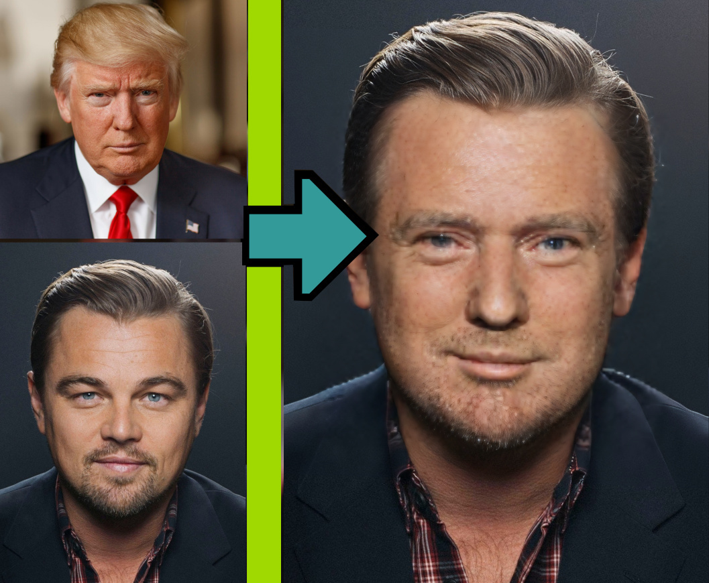

  <h1 align="center" style="margin-top:-25px">Face2Face</h1>

<p align="center">
  
</p>
  <h3 align="center" style="margin-top:-10px">Instantly swap faces in images and videos</h3>
<br/>
Face2Face is a generative AI technology to swap faces (aka Deep Fake) in images from one to another. 
For example, you can swap your face with Mona Lisa or your favorite celebrity.

With this repository you can:

- Swap faces from one image to another. 
- Swap faces in an entire video.
- Create face embeddings. With these embeddings you can later swap faces without running the whole stack again.
- Run face swapping as a service.
- Enhance image quality of a portrait with a face enhancer model.

This is a one shot model; for this reason only one face is needed to swap. It should work for all kinds of content, also for anime.
The face swapping model itself was created by [Insightface](https://github.com/deepinsight/insightface)

We provide the face swapping functionality as SDK and as a convenient web (openAPI) API with [FastTaskAPI](https://github.com/SocAIty/FastTaskAPI).
The endpoint allows you to easily deploy face swapping as a service.

## Example swaps

<table>
<td></td>
<td></td>
</table>


https://github.com/SocAIty/face2face/assets/7961324/f3990fa6-a7b0-463c-a81a-486f658b3c4f

Watch the [hq video](https://www.youtube.com/watch?v=dE-d8DIndco) on youtube

<a href="https://www.youtube.com/watch?v=7l-3UAWh8Pw" align="center">
  
</a>


# Setup

### Install via pip
Depending on your use case you can install the package with or without the service.
```bash
# face2face without service (only for inference from script)
pip install socaity-face2face 
# full package with service
pip install socaity-face2face[full]
# or from GitHub for the newest version.
pip install git+https://github.com/SocAIty/face2face
```
Additional dependencies:
- For VideoFile support in the webservice you also need to install [ffmpeg](https://ffmpeg.org/download.html)


# Usage

We provide three ways to use the face swapping functionality.
1. [Direct module import and inference](#Inference-from-script) 
2. [By deploying and calling the web service](#Web Service)


## Inference from script
Use the Face2Face class to swap faces from one image to another.
First create an instance of the class.

```python
from face2face import Face2Face
f2f = Face2Face(device_id=0) 
```
With the device_id setting you can set the GPU device id. This also allows to run face2face in multiple processes on
different GPUs.

### Easy face swapping
Swap faces from one image to another.
```python
swapped_img = f2f.swap_one(cv2.imread("src.jpg"), cv2.imread("target.jpg"))
```

### Face swapping with saved reference faces

Create a face embedding with the add_reference_face function and later swap faces with the swap_from_reference_face function.

If argument save=true is set, the face embedding is persisted and the f2f.swap_from_reference_face function can be used later with the same face_name, even after restarting the project.
```python
embedding = f2f.add_reference_face("my_new_face", source_img, save=True)
# Swap all faces in the target image with the face in the face embedding
swapped = f2f.swap_from_reference_face("my_new_face", target_img)
```

### Face swapping with face recognition (swap pairs)

After an embedding was created, we can recognize / identify those persons.
Then the identified persons can specifically be swapped with defined swap pairs.
```python
swapped = f2f.swap_known_faces_to_target_faces("test_imgs/test_multi_swap_from_reference.jpg", swap_pairs={
    "trump": "hagrid",
    "biden": "ron"
})
```
This function will swap the faces of trump with hagrid and biden with ron.
Therefore it first recognizes the faces in the target image and then swaps them with the defined swap pairs.


### Swap the faces in a video
Swap faces in a video. The video is read frame by frame and the faces are swapped.
```python
swapped_video = f2f.swap_video(face_name="my_embedding", target_video="my_video.mp4")
```
To use this function you need to install ```socaity-face2face[service]``` or the media_toolkit package.

### Face swapping with a generator
Iteratively swapping from a list of images 
```python
def my_image_generator():
    for i in range(100):
        yield cv2.imread(f"image_{i}.jpg")

for swapped_img in f2f.swap_generator(face_name="my_embedding", target_img_generator=my_image_generator()):
    cv2.imshow("swapped", swapped_img)
    cv2.waitKey(1)
```

### Face enhancing

The roop (inswapper) model operates on low resolution - what can harm the result face quality. 
However, there exist AI models, which can enhance the face quality by upscaling the image.
We provide different models for face enhancement: [gfpgan_1.4](https://github.com/TencentARC/GFPGAN), 
and the [gpen](https://github.com/yangxy/GPEN) family.
Check model_definitions.py for the available models.
You can upscale up to 2048 with the GPEN model --> higher quality + higher runtime.
```python
swapped_img = f2f.swap_one(src_img, target_img, enhance_faces = True, enhance_face_model='gpen_bfr_512' )
```
The corresponding model is automatically downloaded and used when enhance_faces is set to True.


## Web Service

1. Start the server by running the provided .bat file "start_server.bat" 
   2. or by using `python face2face/server.py --port 8020` make sure the python PYTHONPATH is set to the root of this repository.
   3. or if module was installed via pypi by running `from face2face.server import start_server` and then `start_server(port=8020)`
2. To test the server, open `http://localhost:8020/docs` in your browser. You should see the openapi documentation.


Note: The first time you start the server, it will download the models. This can take a while.
If this fails, you can download the files manually and store them in models/ or models/insightface/inswapper_128.onnx

The Webservice is built with [FastTaskAPI](https://github.com/SocAIty/FastTaskAPI). 
In this regard, for each request it will create a task and return a job id

### Face2Face (aka swapping) 


```python
import requests

# load images from disc
with open("src.jpg", "rb") as image:
    src_img = image.read()
with open("target.jpg", "rb") as image:
    target_img = image.read()

# send post request
job = requests.post("http://localhost:8020/api/swap_one", files={"source_img": src_img, "target_img": target_img})
```

### For face embedding generation

```python
import requests

with open("src.jpg", "rb") as image:
    src_img = image.read()

response = requests.post("http://localhost:8020/api/add_reference_face", params={ "face_name": "myface", "save": True}, files={"source_img": src_img})
```
The response is a .npz file as bytes. 
After the embedding was created it can be used in the next swapping with the given face_name.

### For face swapping with saved reference faces

```python
import requests
with open("target.jpg", "rb") as image:
    target_img = image.read()

response = requests.post(
   "http://localhost:8020/api/swap_from_reference_face", 
    params={ "face_name" : "myface"}, files={"target_img": target_img}
)
```
In this example it is assumed that previously a face embedding with name "myface" was created with the add_reference_face endpoint.

### Swap faces in an entire video

```python
import httpx
from media_toolkit import VideoFile
my_video = VideoFile("my_video.mp4")
request = httpx.post(
   "http://localhost:8020/swap_video", params={ "face_name" : "myface"}, 
    files={"target_video": my_video.to_httpx_send_able_tuple()}
)
```

### Parse the results

The response is a json that includes the job id and meta information.
By sending then a request to the job endpoint you can check the status and progress of the job.
If the job is finished, you will get the result, including the swapped image.
```python
import cv2
from io import BytesIO
# check status of job
response = requests.get(f"http://localhost:8020/api/job/{job.json()['job_id']}")
# convert result to image file
swapped = cv2.imread(BytesIO(response.json()['result']))
```
If you want it more convenient use [fastSDK](https://github.com/SocAIty/fastSDK) to built your client,
or the [socaity SDK](https://github.com/SocAIty/socaity).

# Disclaimer

The author is not responsible for any misuse of the repository. Face swapping is a powerful technology that can be used for good and bad purposes.
Please use it responsibly and do not harm others. Do not publish any images without the consent of the people in the images.
The credits for face swapping technology go to the great Insightface Team thank you [insightface.ai](https://insightface.ai/). 
This project uses their pretrained models and parts of their code. Special thanks goes to their work around [ROOP](https://github.com/s0md3v/sd-webui-roop).
The author does not claim authorship for this repository. The authors contribution was to provide a convenient API and service around the face swapping.
A big thank you also goes to all contributors of face enhancement methods in [facefusion](https://github.com/facefusion/facefusion/tree/master) 
which inspired the face enhancement implementation in this project. 


# Contribute

Any help with maintaining and extending the package is welcome. Feel free to open an issue or a pull request.

ToDo: 
- Setting device ID also for enhancer via face2face class instead of global settings.
- make inference faster by implementing batching.
- Implement strength factor for applied face
- streaming for the webserver
- implement video2video with auto face recognition
- remove insightface dependency and update onnx version