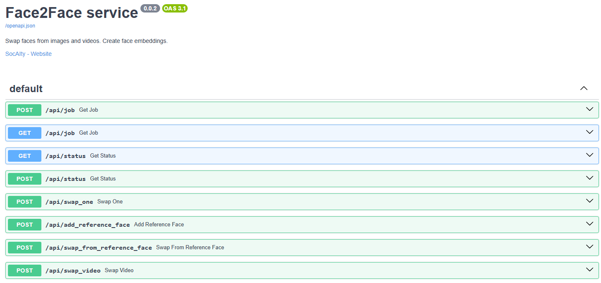

# Web Service for Face2Face



# Starting the Web Service

In your cmd start the server with:
- `python -m face2face.server` 

Note: The first time you start the server, it will download the models. This can take a while.

# How it works:

The webservice is built with [APIPod](https://github.com/SocAIty/APIPod).  
Each request creates a job and returns a JSON payload with a `job_id`.
You can then poll the status endpoint (`/status/{job_id}`) and retrieve the result.

Read the documentations of [APIPod](https://github.com/SocAIty/APIPod) and
[media-toolkit](https://github.com/SocAIty/media-toolkit) to get the most out of the service and to familiarize yourself with the concepts.


# Configuration

You can configure some settings via environment variables:

| ENV Variable | Description                                                                                                                             |
|--------------|-----------------------------------------------------------------------------------------------------------------------------------------|
| MODELS_DIR | Path to the folder where the models are stored. For example the inswapper and the GPEN models are downloaded and stored in this folder. |
| EMBEDDINGS_DIR | Path to the folder where the face embeddings are stored. Stored faces can be reused by the api.                                         |
| ALLOW_EMBEDDING_SAVE_ON_SERVER | If set to True, the embeddings can be saved on the server. Consider to set it false to avoid memory overflow or in multi-user scenarios |


# Deployment, Runpod, Docker, file uploads and more

For more settings and how to deploy the service check out [APIPod](https://github.com/SocAIty/APIPod).

For example it allows you to deploy the service with [Runpod](https://runpod.io) out of the box.
Checkout the [DOCKERFILE](DOCKERFILE) for runpod.
To start APIPod with runpod backend set the environment variable `APIPOD_BACKEND=runpod`.

# Usage

The webservice provides enpdoints for the swap, add_face and enhance_face functionality.
You can send requests to the endpoints with any http client, e.g. requests, httpx, curl, etc.

Using [fastSDK](https://github.com/SocAIty/fastSDK) is the most convenient way to interact with the webservice.
You can find an implementation of an SDK generated for fastSDK in the [socaity SDK](https://github.com/SocAIty/socaity/tree/main/socaity/api/image/img2img/face2face) documentation.


## With plain web requests
### Send requests

First encode the image as bytes.
```python
# load images from disc
with open("myimage.jpg", "rb") as image:
    my_image = image.read()
```
Then send a post request to the endpoint.
```python
import requests

submit = requests.post(
    "http://localhost:8020/add-face",
    files={"image": ("face.jpg", my_image, "image/jpeg")},
    data={"face_name": "biden"},
)
my_job = submit.json()
```

### Parse the results

The response is a json that includes the job id and meta information.
By sending then a request to the job endpoint you can check the status and progress of the job.
If the job is finished, you will get the result, including the swapped image.
```python
import requests

# check status of job
status = requests.get(f"http://localhost:8020/status/{my_job['job_id']}").json()

# metrics now expose execution_time_s instead of total_time_s
metrics = status.get("metrics", {})
print("execution_time_s:", metrics.get("execution_time_s"))

# result is a media payload; for files, content is usually a URL
result = status.get("result", {})
image_url = result.get("content")
image_bytes = requests.get(image_url, timeout=60).content
with open("swapped_img.png", "wb") as f:
    f.write(image_bytes)
```

